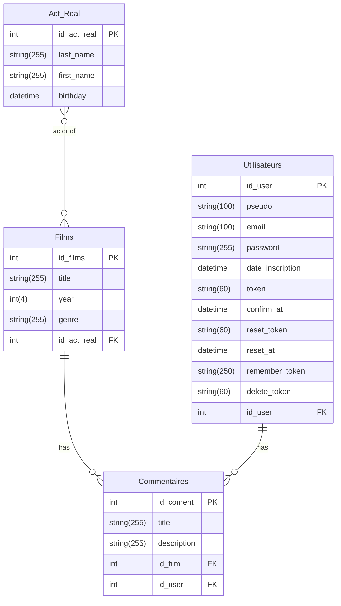

# TODO

- [ ] Changer nom de fichier pour mieux m'y retrouver.
- [ ] Ajouter table Acteurs/Réalisateurs (id, nom, prénom, date de naissance, biographie, avis, statut)
- [ ] Ajouter table Films (id,titre, année, genre, 🔑id_acteur)
- [ ] Ajouter table commentaires (titre, description, 🔑id_film)

